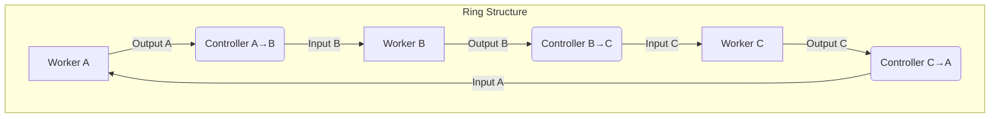

# Go 1.25+ WaitGroup usage
```go
// Copyright 2011 The Go Authors. All rights reserved.
// Use of this source code is governed by a BSD-style
// license that can be found in the LICENSE file.

package sync

import (
	"internal/race"
	"internal/synctest"
	"sync/atomic"
	"unsafe"
)

// A WaitGroup is a counting semaphore typically used to wait
// for a group of goroutines or tasks to finish.
//
// Typically, a main goroutine will start tasks, each in a new
// goroutine, by calling [WaitGroup.Go] and then wait for all tasks to
// complete by calling [WaitGroup.Wait]. For example:
//
//	var wg sync.WaitGroup
//	wg.Go(task1)
//	wg.Go(task2)
//	wg.Wait()
//
// A WaitGroup may also be used for tracking tasks without using Go to
// start new goroutines by using [WaitGroup.Add] and [WaitGroup.Done].
//
// The previous example can be rewritten using explicitly created
// goroutines along with Add and Done:
//
//	var wg sync.WaitGroup
//	wg.Add(1)
//	go func() {
//		defer wg.Done()
//		task1()
//	}()
//	wg.Add(1)
//	go func() {
//		defer wg.Done()
//		task2()
//	}()
//	wg.Wait()
//
// This pattern is common in code that predates [WaitGroup.Go].
//
// A WaitGroup must not be copied after first use.
```

# pipeline並列の一般化

今回のようなpropose/observeループはリング構造をなす

要するに、proposeからobserveへのcontrollerと、探索アルゴリズムの中核である状態更新同期GenServerループは、リングモデルにおいて等価であり、observeからproposeへのcontrollerとみなすことができる

つまり、pipelineモジュールではGoControllerとGoWorkersの二種類があればよさそう



停止は、外部か、controllerに渡されるlogicが内部でcaptureしているstateに応じてlogicでtriggerされる、**cancelによってのみ**発生する
