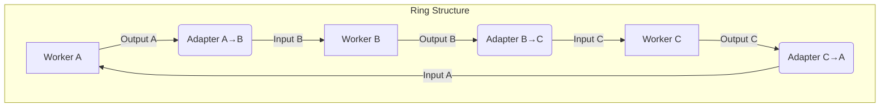
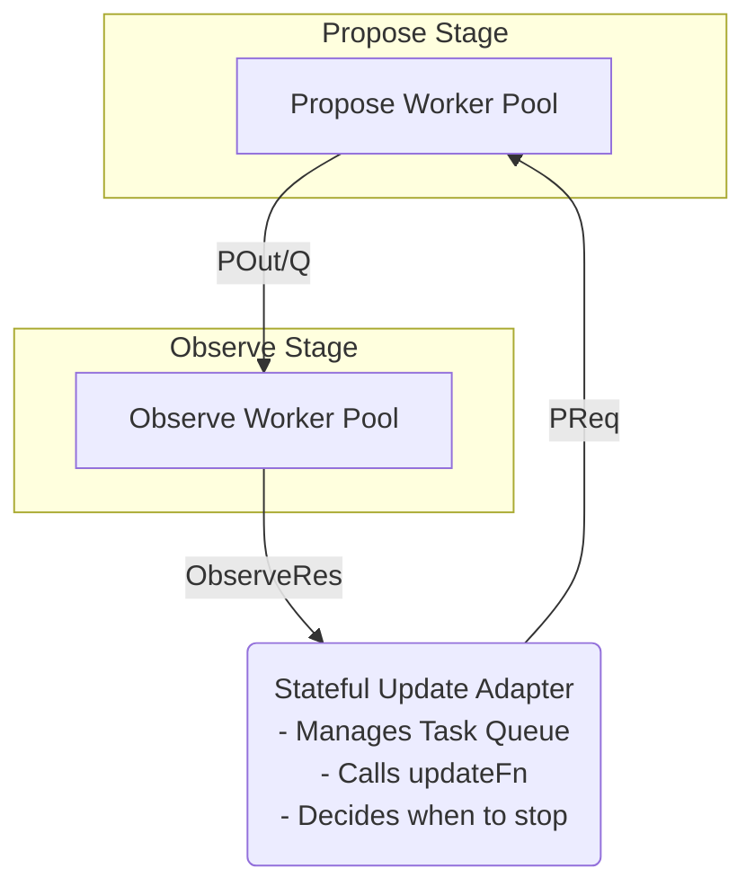

# pipeline並列の一般化

今回のようなpropose/observeループはリング構造をなす

要するに、propose から observeへのadapterが存在する場合、そのadapterと、探索アルゴリズムの中核である状態更新同期GenServerループは、このモデルにおいて等価であり、observeからproposeへのadapterとみなすことができる

つまり、pipelineモジュールではNewAdapterとlaunchworkersの二種類があればよい...？

