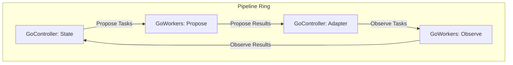

# Go 1.25+ WaitGroup usage
```go
// Copyright 2011 The Go Authors. All rights reserved.
// Use of this source code is governed by a BSD-style
// license that can be found in the LICENSE file.

package sync

import (
	"internal/race"
	"internal/synctest"
	"sync/atomic"
	"unsafe"
)

// A WaitGroup is a counting semaphore typically used to wait
// for a group of goroutines or tasks to finish.
//
// Typically, a main goroutine will start tasks, each in a new
// goroutine, by calling [WaitGroup.Go] and then wait for all tasks to
// complete by calling [WaitGroup.Wait]. For example:
//
//	var wg sync.WaitGroup
//	wg.Go(task1)
//	wg.Go(task2)
//	wg.Wait()
//
// A WaitGroup may also be used for tracking tasks without using Go to
// start new goroutines by using [WaitGroup.Add] and [WaitGroup.Done].
//
// The previous example can be rewritten using explicitly created
// goroutines along with Add and Done:
//
//	var wg sync.WaitGroup
//	wg.Add(1)
//	go func() {
//		defer wg.Done()
//		task1()
//	}()
//	wg.Add(1)
//	go func() {
//		defer wg.Done()
//		task2()
//	}()
//	wg.Wait()
//
// This pattern is common in code that predates [WaitGroup.Go].
//
// A WaitGroup must not be copied after first use.
```

# pipeline.go
```go
package pipeline

import (
	"context"
	"sync"
)

type Ring struct {
	ctx context.Context
	wg  sync.WaitGroup
}

func NewRing(ctx context.Context) *Ring {
	return &Ring{ctx: ctx}
}

func (r *Ring) Wait() {
	r.wg.Wait()
}

func GoWorkers[Req, Res any](
	r *Ring,
	concurrency int,
	taskFn func(ctx context.Context, req Req) Res,
	reqCh <-chan Req,
	resCh chan<- Res,
) {
	var stageWg sync.WaitGroup
	stageWg.Add(concurrency)

	for range concurrency {
		r.wg.Go(func() {
			defer stageWg.Done()
			for {
				select {
				case <-r.ctx.Done():
					return
				case req, ok := <-reqCh:
					if !ok {
						return
					}
					result := taskFn(r.ctx, req)
					select {
					case <-r.ctx.Done():
						return
					case resCh <- result:
					}
				}
			}
		})
	}

	r.wg.Go(func() {
		stageWg.Wait()
		close(resCh)
	})
}

func GoController[Req, Res any](
	r *Ring,
	onResult func(res Res) (done bool),
	onNextTask func() (task Req, ok bool),
	onTaskSent func(task Req),
	resCh <-chan Res,
	reqCh chan<- Req,
) {
	r.wg.Go(func() {
		defer close(reqCh)
		for {
			nextTask, hasTask := onNextTask()

			var sendCh chan<- Req
			if hasTask {
				sendCh = reqCh
			}

			select {
			case <-r.ctx.Done():
				return
			case res, ok := <-resCh:
				if !ok {
					return
				}
				if onResult(res) {
					return
				}
			case sendCh <- nextTask:
				onTaskSent(nextTask)
			}
		}
	})
}
```

# Introduction

In Go's CSP model, managing the lifecycle of goroutines—avoiding deadlocks, synchronizing state, and ensuring a graceful shutdown of the entire system—requires careful, albeit boilerplate, implementation.

This `pipeline` package provides simple, composable primitives that encapsulate these concerns. This allows users to focus on implementing their application's core logic.

# Overview

This package offers three main components for building concurrent pipelines, based on a "ring architecture" model where data circulates through channels.

-   **`Ring`**: A container that manages the entire lifecycle (creation, execution, termination) of the pipeline.
-   **`GoWorkers`**: An asynchronous component that executes time-consuming tasks, such as I/O-bound operations, in parallel across multiple goroutines.
-   **`GoController`**: A synchronous component that runs on a single goroutine to handle state management and task distribution logic.

By connecting these components with channels, you can construct a pipeline like the one shown below.



# Ring

The `Ring` manages the lifetime of all components within the pipeline. Its responsibilities are to handle cancellation via a `context` and to wait for the graceful termination of all goroutines using a `sync.WaitGroup`.

### Usage

1.  Create a `Ring` instance from a `context` using `pipeline.NewRing(ctx)`.
2.  Pass the created `Ring` instance to all `GoController` and `GoWorkers` components to start their respective goroutines.
3.  Call `ring.Wait()` at the end of your main logic. This is a blocking call that waits until all goroutines in the pipeline have gracefully terminated.

Termination can be triggered in two ways:
- **Graceful Shutdown**: A `GoController` signals it's done, closing its output channel. This closure propagates through the pipeline, causing each subsequent component to finish its work and shut down.
- **Forced Shutdown**: The `context` provided to the `Ring` is canceled.

```go
ctx, cancel := context.WithCancel(context.Background())
defer cancel() // Good practice to ensure context is always cancelled.

ring := pipeline.NewRing(ctx)

// ... Start GoWorkers and GoController with the ring ...

// The pipeline will now run.
// It will stop either when a graceful shutdown is initiated by a component,
// or when the context is cancelled.

ring.Wait()  // Blocks until all goroutines have finished.
```

# GoWorkers

`GoWorkers` launches and manages a group of worker goroutines that execute a specific task (`taskFn`) with a specified degree of parallelism (`concurrency`). It is primarily used for asynchronous operations where parallelization can improve throughput, such as network I/O or heavy computations.

It receives tasks from the `reqCh` channel, executes the `taskFn`, and sends the results to the `resCh` channel. When the `Ring`'s `context` is canceled, all workers terminate safely. The `resCh` is closed after all worker goroutines have finished.

# GoController

`GoController` is a component responsible for synchronous processing, such as state management and task routing within the pipeline. It operates on a single internal goroutine, allowing it to **safely manage state without the need for mutexes or other locking mechanisms**.

It receives results from a `resCh` channel, updates its state based on those results, and sends new tasks to a `reqCh` channel. This behavior is defined by the following three callback functions:

-   `onResult`: Processes a result received from `resCh`. This can involve updating state, adding new tasks to a queue, or checking for termination conditions.
-   `onNextTask`: Retrieves the next task from a queue to be sent to `reqCh`.
-   `onTaskSent`: Called immediately after a task is sent to `reqCh`, for instance, to remove it from the queue.

This design centralizes state access logic within a single goroutine, making it possible to describe complex state transitions without worrying about race conditions.

# Shutdown Sequence

The pipeline supports two shutdown mechanisms: graceful and forced.

### Graceful Shutdown

A graceful shutdown is initiated when a `GoController` determines that the pipeline's work is complete.

1.  A `GoController`'s `onResult` callback returns `true`.
2.  The `GoController` immediately returns, and its `defer` statement closes its output channel (`reqCh`).
3.  In the subsequent `GoWorkers` stage, each worker goroutine is listening on the `reqCh`. When the channel is closed, the `select` statement's read operation returns a zero value and `ok == false`. This causes the worker's processing loop to terminate.
4.  Some workers may be in the middle of executing a task when the channel closes. The `GoWorkers` component waits for these in-flight tasks to complete.
5.  After all worker goroutines in the stage have finished and exited, the `GoWorkers` component closes its own output channel (`resCh`).
6.  **This closure of `resCh` serves as the shutdown signal for the next stage in the pipeline.** This process repeats, creating a chain reaction that gracefully shuts down each component in sequence.
7.  The `ring.Wait()` call unblocks only after every component has shut down and all their goroutines have terminated.

### Forced Shutdown

A forced shutdown occurs when the `context` passed to `pipeline.NewRing(ctx)` is canceled.

1.  The `context`'s `Done()` channel is closed.
2.  All `select` statements within `GoController` and `GoWorkers` are listening for this cancellation.
3.  Upon cancellation, each goroutine immediately returns, terminating its execution.

This provides a mechanism to forcibly stop the entire pipeline from an external signal.

# Your Task
pipeline.goのシャットダウンシーケンスに問題がないか、厳密に検証してください。
