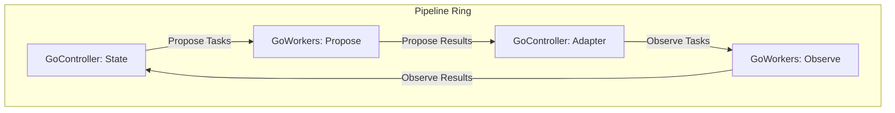

# Introduction

In Go's CSP model, managing the lifecycle of goroutines—avoiding deadlocks, synchronizing state, and ensuring a graceful shutdown of the entire system—requires careful, albeit boilerplate, implementation.

This `pipeline` package provides simple, composable primitives that encapsulate these concerns. This allows users to focus on implementing their application's core logic.

# Overview

This package offers three main components for building concurrent pipelines, based on a "ring architecture" model where data circulates through channels.

-   **`Ring`**: A container that manages the entire lifecycle (creation, execution, termination) of the pipeline.
-   **`GoWorkers`**: An asynchronous component that executes time-consuming tasks, such as I/O-bound operations, in parallel across multiple goroutines.
-   **`GoController`**: A synchronous component that runs on a single goroutine to handle state management and task distribution logic.

By connecting these components with channels, you can construct a pipeline like the one shown below.



# Ring

The `Ring` manages the lifetime of all components within the pipeline. Its responsibilities are to handle cancellation via a `context` and to wait for the graceful termination of all goroutines using a `sync.WaitGroup`.

### Usage

1.  Create a `Ring` instance from a `context` using `pipeline.NewRing(ctx)`.
2.  Pass the created `Ring` instance to all `GoController` and `GoWorkers` components to start their respective goroutines.
3.  Call `ring.Wait()` at the end of your main logic. This is a blocking call that waits until all goroutines in the pipeline have gracefully terminated.

Termination can be triggered in two ways:
- **Graceful Shutdown**: A `GoController` signals it's done, closing its output channel. This closure propagates through the pipeline, causing each subsequent component to finish its work and shut down.
- **Forced Shutdown**: The `context` provided to the `Ring` is canceled.

```go
ctx, cancel := context.WithCancel(context.Background())
defer cancel() // Good practice to ensure context is always cancelled.

ring := pipeline.NewRing(ctx)

// ... Start GoWorkers and GoController with the ring ...

// The pipeline will now run.
// It will stop either when a graceful shutdown is initiated by a component,
// or when the context is cancelled.

ring.Wait()  // Blocks until all goroutines have finished.
```

# GoWorkers

`GoWorkers` launches and manages a group of worker goroutines that execute a specific task (`taskFn`) with a specified degree of parallelism (`concurrency`). It is primarily used for asynchronous operations where parallelization can improve throughput, such as network I/O or heavy computations.

It receives tasks from the `reqCh` channel, executes the `taskFn`, and sends the results to the `resCh` channel. When the `Ring`'s `context` is canceled, all workers terminate safely. The `resCh` is closed after all worker goroutines have finished.

# GoController

`GoController` is a component responsible for synchronous processing, such as state management and task routing within the pipeline. It operates on a single internal goroutine, allowing it to **safely manage state without the need for mutexes or other locking mechanisms**.

It receives results from a `resCh` channel, updates its state based on those results, and sends new tasks to a `reqCh` channel. This behavior is defined by the following three callback functions:

-   `onResult`: Processes a result received from `resCh`. This can involve updating state, adding new tasks to a queue, or checking for termination conditions.
-   `onNextTask`: Retrieves the next task from a queue to be sent to `reqCh`.
-   `onTaskSent`: Called immediately after a task is sent to `reqCh`, for instance, to remove it from the queue.

This design centralizes state access logic within a single goroutine, making it possible to describe complex state transitions without worrying about race conditions.

# Shutdown Sequence

### Graceful Shutdown

This process is initiated by a `GoController`.

1.  The `onResult` callback in a `GoController` returns `true`. The goroutine returns.
2.  The `defer` statement in the `GoController` executes.
    *   It closes the controller's output channel (`reqCh`).
    *   It begins a `for range` loop on its input channel (`resCh`), consuming any subsequent values until that channel is closed.
3.  Downstream `GoWorkers` goroutines reading from `reqCh` receive the close signal (`ok == false`) and exit their loops.
4.  Worker goroutines that are still executing a `taskFn` complete their current task.
5.  After completing the task, each of these workers sends its result to `resCh`. The upstream controller's draining loop receives the result, which unblocks the worker and allows its goroutine to terminate.
6.  After all worker goroutines in the `GoWorkers` stage have terminated, the `GoWorkers` component closes its output channel (`resCh`).
7.  The closure of this `resCh` acts as the shutdown trigger for the next component in the pipeline, repeating the process from step 3.
8.  `ring.Wait()` returns after all goroutines have terminated.

### Forced Shutdown

This process is initiated by canceling the `context`.

1.  The `context` passed to `NewRing` is canceled.
2.  The `context.Done()` channel is closed.
3.  The `select` statements in all `GoController` and `GoWorkers` goroutines are listening on this channel via `<-r.Ctx.Done()`.
4.  This case is selected, causing each goroutine to execute a `return` statement and terminate.
