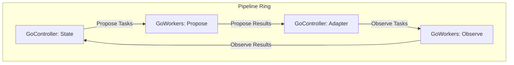

# 導入

GoのCSPモデルは強力な並行処理のプリミティブを提供するが、複数の非同期ステージを持つデータ処理パイプライン（例: `propose-observe`ループ）の構築は依然として複雑さを伴う。特に、ゴルーチンのライフサイクル管理、チャネルの安全なクローズ、複数ステージにまたがる状態の同期、そしてシステム全体の正常なシャットダウンといった処理は、定型的でありながら慎重な実装が求められる。

本`pipeline`パッケージは、これらの定型的な処理をカプセル化した、シンプルで合成可能なプリミティブを提供する。これにより、利用者はアプリケーション固有のコアロジックの実装に集中できる。

# 概要

本パッケージは、イベント駆動型の並行パイプラインを構築するための、3つの主要コンポーネントを提供する。その設計は、データがチャネルを介して循環する「リング構造」モデルに基づいている。

-   **`Ring`**: パイプライン全体のライフサイクル（生成、実行、終了）を管理するコンテナ。
-   **`GoWorkers`**: I/Oバウンドなど、時間のかかるタスクを複数のゴルーチンで並列実行する非同期コンポーネント。
-   **`GoController`**: 状態管理やタスクの分配ロジックを担う、単一ゴルーチンで動作する同期コンポーネント。

これらのコンポーネントをチャネルで繋ぎ合わせることで、堅牢でスケーラブルなパイプラインを構築できる。



# Ring

`Ring`は、パイプラインを構成する全コンポーネントの生存期間を管理する。`context`によるキャンセル処理と`sync.WaitGroup`による全ゴルーチンの正常終了の待機を責務とする。

### 使い方

1.  `context`から`pipeline.NewRing(ctx)`を用いて`Ring`インスタンスを生成する。
2.  生成した`Ring`インスタンスを、パイプラインを構成する全ての`GoController`および`GoWorkers`に渡して起動する。
3.  パイプラインの実行を開始し、キャンセルされるまで待機するために`ring.Loop()`を呼び出す。これはブロッキングされる。
4.  `context`がキャンセルされると`ring.Loop()`が終了する。その後、全てのコンポーネントが完全に終了したことを保証するために`ring.Wait()`を呼び出す。

```go
ctx, cancel := context.WithCancel(context.Background())
ring := pipeline.NewRing(ctx)

// ... GoWorkersとGoControllerをringとともに起動 ...

// どこかで終了条件が満たされたら cancel() を呼ぶ

ring.Loop()  // キャンセルされるまでブロック
ring.Wait()  // 全てのゴルーチンが終了するまでブロック
```

# GoWorkers

`GoWorkers`は、特定のタスク（`taskFn`）を、指定された並列度（`concurrency`）で実行するワーカーゴルーチン群を起動・管理する。主に、ネットワークI/Oや重い計算処理など、並列化によってスループットを向上させたい非同期処理に用いる。

`reqCh`チャネルからタスクを受け取り、`taskFn`を実行した結果を`resCh`チャネルへ送信する。`Ring`の`context`がキャンセルされると、全てのワーカーは安全に終了する。また、ワーカー群が全て終了した後に`resCh`を自動的にクローズする。

# GoController

`GoController`は、パイプラインの状態管理やタスクのルーティングといった、同期的な処理を担うコンポーネントである。内部で単一のゴルーチンを起動し、その中で全ての処理を行うため、**Mutexなどのロック機構なしで安全に状態を管理できる**（Stateful Goroutine）。

`resCh`チャネルから結果を受け取り、その結果に基づいて状態を更新し、次のタスクを`reqCh`チャネルへ送信する。この一連の振る舞いは、以下の3つのコールバック関数によって定義される。

-   `onResult`: `resCh`から受信した結果を処理する。状態更新や、次に実行すべきタスクのキューへの追加、終了条件の判定などを行う。
-   `onNextTask`: タスクキューから次に`reqCh`へ送信すべきタスクを取り出す。
-   `onTaskSent`: タスクが`reqCh`へ送信された直後に呼び出され、タスクキューからの削除などを行う。

この設計により、状態アクセスのロジックが単一のゴルーチンに集約され、競合状態の心配なく複雑な状態遷移を記述できる。